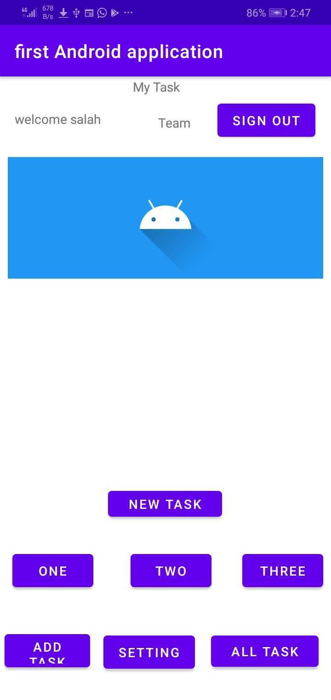

# taskmaster
## lab 37
- allow users to optionally select a file to attach to that task.
## screenshot

## lab 36
-  Add in user login and sign up flows to your application, using Cognito’
## screenshot

## lab 33
- Create a second entity for a team, which has a name and a list of tasks. Update your tasks to be owned by a team.
## screenshot

## lab 32
-  Using the amplify add api command, create a Task resource that replicates our existing Task schema. Update all references to the Task data to instead use AWS Amplify to access your data in DynamoDB instead of in Room. 
## screenshot

## lab 31
-  Add Espresso to your application, and use it to test basic functionality of the main components of your application.

## screenshot

## lab 29
-  set up Room in your application, and modify your Task class to be an Entity.
- Modify your Add Task form to save the data entered in as a Task in your local database.
- Refactor your homepage’s RecyclerView to display all Task entities in your database.
- 
## screenshot

## lab 28
- Create a ViewAdapter class that displays data from a list of Tasks.
- In your MainActivity, create at least three hardcoded Task instances and use those to populate your RecyclerView/ViewAdapter.
## screenshot

## lab 27
- Create a Task Detail page. It should have a title at the top of the page, and a Lorem Ipsum description.
- Create a Settings page. It should allow users to enter their username and hit save.
- The main page should be modified to contain three different buttons with hardcoded task titles. When a user taps one of the titles, it should go to the Task Detail page, and the title at the top of the page should match the task title that was tapped on the previous page.
## screenshot

## lab 26
- it should have a heading at the top of the page, an image to mock the “my tasks” view, and buttons at the bottom of the page to allow going to the “add tasks” and “all tasks” page
- On the “Add a Task” page, allow users to type in details about a new task, specifically a title and a body. When users click the “submit” button, show a “submitted!” label on the page.
## screenshot

